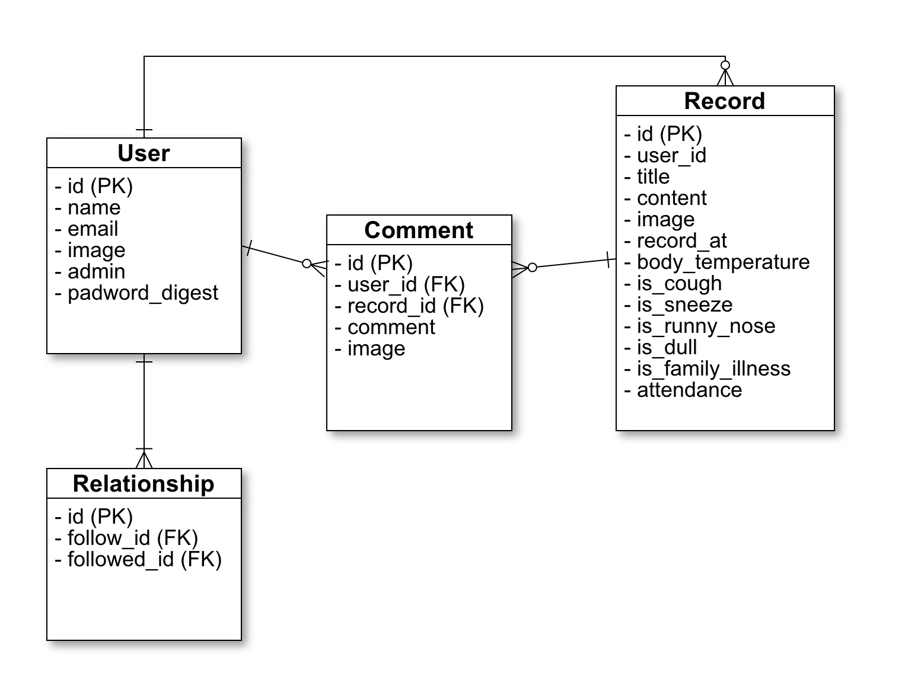
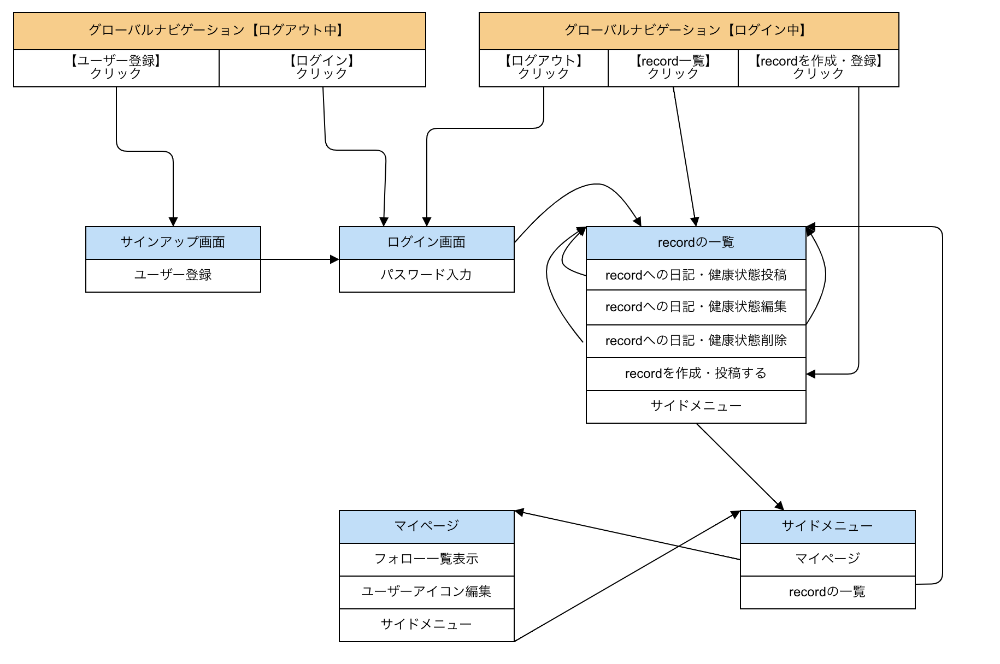

# README
___
## 概要
様々な地域から生徒が集まる団体をサポートするSNSアプリケーション。  
練習に参加する際に紙で提出していた健康情報をアプリ上で運用することで、  
管理効率upとペーパーレス化を実現。  
運営から試合やイベントのお知らせを掲示板で確認でき、スクール生の親同士が  
子供の成長記録を互いに閲覧しながら交流するきっかけを与えてくれるツール。
___
## 開発背景
ラグビースクールのコーチをやっており、屋外での紙のやり取りで健康管理を実施している  
現状は非効率的に感じていました。  
また、子供を離れて見守っていることもあり、親同士の交流が少ないように感じたため、  
交流のきっかけを作ることができ、情報交換がしやすくなるアプリケーションがあれば  
便利だと考えました。
___
## 開発言語
- Ruby2.6.5
- Rails5.2.5
___
## 就業Termの技術
- devise
- Ajax
___
## カリキュラム外の技術
- ransack
___
## 実行手順
```
% git clone git@github.com:yoozisan/rugnet_app.git  
% cd rugnet_app  
% bundle install  
% rails db:create db:migrate  
% rails s  
```
___
## カタログ設計
https://docs.google.com/spreadsheets/d/1Y96PhrgZGLzTAPWC_ZkVKqAWRHPDSI7Sv8s2sc_hHQo/edit?usp=sharing
___
## テーブル定義書
https://docs.google.com/spreadsheets/d/1hzAbyxjLovcge9Ddhbx5SSFlFNI004E6HDnDMMqzIlk/edit?usp=sharing
___
## ワイヤーフレーム
https://cacoo.com/diagrams/Kkj8rj5SmGXuR4hc/193DD
___
## ER図

## 画面遷移図

