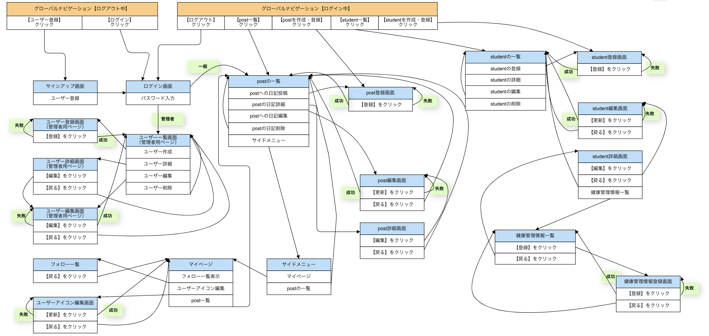

# README
___
## 概要
練習に参加する日に紙で提出していた健康情報をアプリ上で記録することで、  
管理効率upとペーパーレス化を実現。  
また、ユーザー（子供の親）が子供の練習記録等を互いに閲覧することで、  
交流するきっかけを与えてくれるツール。
___
## 開発背景
ラグビースクールのコーチをやっており、屋外での紙のやり取りで健康管理を実施している  
現状は非効率的に感じていました。  
また、子供を離れて見守っていることもあり、親同士の交流が少ないように感じたため、  
交流のきっかけを作ることができ、情報交換がしやすくなるアプリケーションがあれば  
便利だと考えました。
___
## 開発言語
- Ruby2.6.5
- Rails5.2.5
- PostgreSQL13.2
___
## 就業Termの技術
- devise
- Ajax
___
## カリキュラム外の技術
- ransack
___
## 実行手順
```
% git clone git@github.com:yoozisan/rugnet_app.git  
% cd rugnet_app  
% bundle install  
% rails db:create db:migrate  
% rails s  
```
___
## カタログ設計
https://docs.google.com/spreadsheets/d/1Zr4o7rt2UtdrlccJ8jZYKnJqgq1-kmaxyFQkEtXPouQ/edit?usp=sharing
___
## テーブル定義書
https://docs.google.com/spreadsheets/d/1T1s24NbtD3cWfBBjiCXwPxMKUBPseSvci-s_9-19JJQ/edit?usp=sharing
___
## ワイヤーフレーム
https://cacoo.com/diagrams/9lP8X9HudchZ2tGf-32E33.png
___
## ER図


## 画面遷移図

